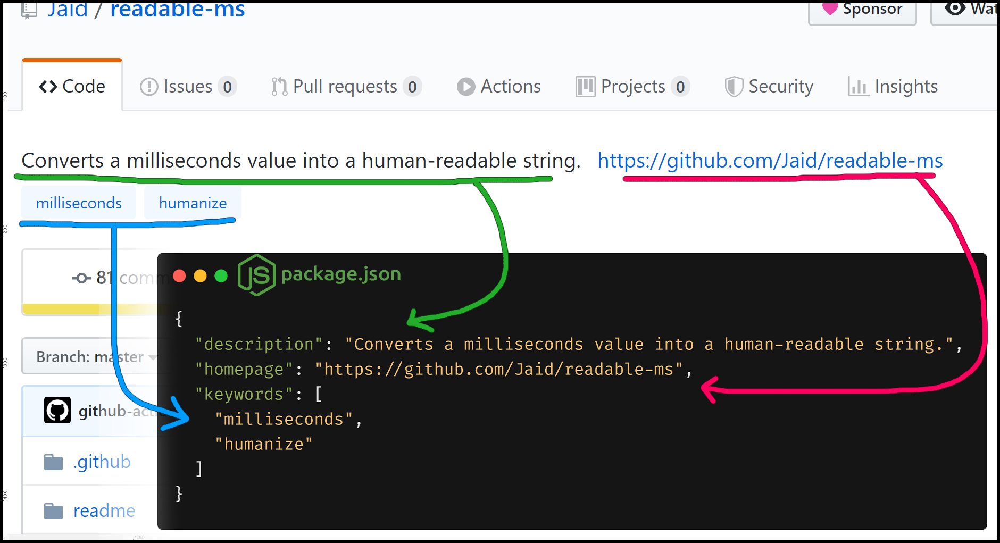
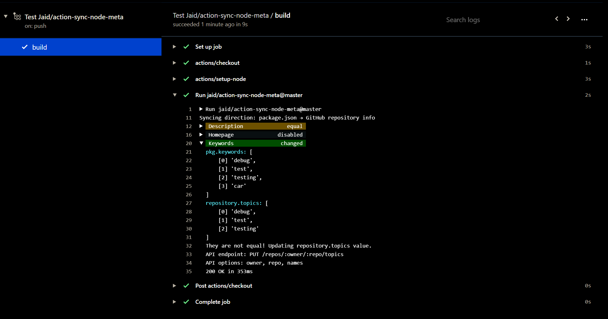

# action-sync-node-meta


<a href="https://raw.githubusercontent.com/jaid/action-sync-node-meta/master/license.txt"></a> <a href="https://github.com/sponsors/jaid"></a>  
<a href="https://actions-badge.atrox.dev/jaid/action-sync-node-meta/goto"></a> <a href="https://github.com/jaid/action-sync-node-meta/commits"></a> <a href="https://github.com/jaid/action-sync-node-meta/commits"></a> <a href="https://github.com/jaid/action-sync-node-meta/issues"></a>  

**GitHub Action that syncs package.json with the repository metadata (description, homepage, topics/keywords).**


There are values that are meant to be the same. Why not automatically keep them synchronized?



### Example output




## Example

### overwrite-file

Example workflow that runs whenever commits are pushed on branch `master`.  
This will overwrite the `package.json` file if it differs from the GitHub repository info.

`.github/workflows/example.yml`
```yaml
name: Sync package.json with repository info
on:
  push:
    branches: [master]
jobs:
  build:
    runs-on: ubuntu-latest
    steps:
      - name: actions/checkout
        uses: actions/checkout@v2.0.0
      - name: actions/setup-node
        uses: actions/setup-node@v1.4.1
        with:
          node-version: "13.9.0"
      - name: Jaid/action-sync-node-meta
        uses: jaid/action-sync-node-meta@v1.0.0
        githubToken: ${{ secrets.GITHUB_TOKEN }}
```

### overwrite-github

Example workflow that runs whenever commits are pushed on branch `master`.  
This will change the GitHub repository info whenever it differs from the content of `package.json`.

The secret `customGithubToken` is forwarded to the input `token`. It has to be a [personal access token](https://github.com/settings/tokens) with scope "repo" added in [your repository's secrets settings](https://github.com/YOUR_NAME/YOUR_REPOSITORY/settings/secrets).

`.github/workflows/example2.yml`
```yaml
name: Sync repository info with package.json
on:
  push:
    branches: [master]
jobs:
  build:
    runs-on: ubuntu-latest
    steps:
      - name: actions/checkout
        uses: actions/checkout@v2.0.0
      - name: actions/setup-node
        uses: actions/setup-node@v1.4.1
        with:
          node-version: "13.9.0"
      - name: Jaid/action-sync-node-meta
        uses: jaid/action-sync-node-meta@v1.0.0
        direction: overwrite-github
        githubToken: ${{ secrets.customGithubToken }}
```


## Options


<table>
<tr>
<th></th>
<th></th>
<th>Default</th>
<th>Info</th>
</tr>
<tr>
<td>githubToken</td>
<td>*</td>
<td></td>
<td>Repository token for allowing the action to make commits or change the repository info. If direction is "overwrite-file", this input be set from forwarding secrets.GITHUB_TOKEN in the workflow file. If direction is "overwrite-github", a custom personal access token with "repo" scope has to be created.</td>
</tr>
<tr>
<td>approve</td>
<td></td>
<td>true</td>
<td>If true and direction is "overwrite-file", pull requests created by this action are automatically approved and merged.</td>
</tr>
<tr>
<td>commitMessagePrefix</td>
<td></td>
<td>autofix: </td>
<td>Prefix string used in messages for automatically generated commits</td>
</tr>
<tr>
<td>direction</td>
<td></td>
<td>overwrite-file</td>
<td>The syncing direction, can be "overwrite-file" or "overwrite-github". If "overwrite-file", the file package.json will be edited in a pull request according to the GitHub repository info. If "overwrite-github", the GitHub repository info will be changed according to the content of the package.json file.</td>
</tr>
<tr>
<td>removeBranch</td>
<td></td>
<td>true</td>
<td>If true and direction is "overwrite-file" and approve is also true, automatically merged pull requests will delete their branch afterwards.</td>
</tr>
<tr>
<td>syncDescription</td>
<td></td>
<td>true</td>
<td>If true, package.json[description] will be synced with GitHub repository description.</td>
</tr>
<tr>
<td>syncHomepage</td>
<td></td>
<td>true</td>
<td>If true, package.json[homepage] will be synced with GitHub repository homepage.</td>
</tr>
<tr>
<td>syncKeywords</td>
<td></td>
<td>true</td>
<td>If true, package.json[keywords] will be synced with GitHub repository topics.</td>
</tr>
</table>


## Development


Setting up:
```bash
git clone git@github.com:jaid/action-sync-node-meta.git
cd action-sync-node-meta
npm install
```


## License
[MIT License](https://raw.githubusercontent.com/jaid/action-sync-node-meta/master/license.txt)  
Copyright © 2020, Jaid \<jaid.jsx@gmail.com> (https://github.com/jaid)
